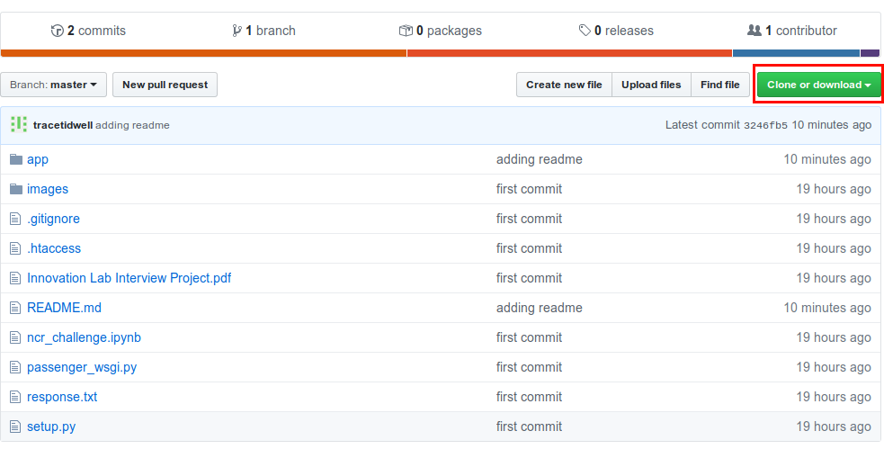
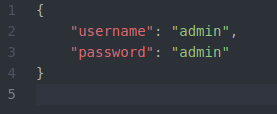
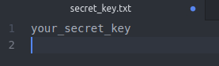

# NCR Coding Challenge

This repo contains a coding challenge given to me by NCR as part of a job interview process. I created a web app for a thrift store that allows customers to browse inventory online and lets employees maintain the inventory.

## Download or Clone Repo

To get started, you will need to first download or clone the repo. To download the repo, click on the green "Clone or download" button shown in the image below.

To clone the repo, open a terminal, navigate to the directory where you would like to save the repo, and type:

`git clone https://github.com/tracetidwell/ncr.git`

After cloning the repo, change into the 'ncr' directory.

## Install dependencies

### Anaconda

I use Anaconda for environment and package management. This is simply a personal preference. However, if you don't use some sort of package management, I highly recommend you do so. If you would like to download Anaconda, you can do so [here](https://www.anaconda.com/distribution/).

Once Anaconda is installed, you can create an environment by typing the command below in the terminal from the root folder of the project/repo:

`conda env create -f environment.yml`

### Pip

To use pip, from the root folder of the project/repo, use the following command from the terminal:

`pip install -r requirements.txt`

## Initialize Database

For this project, I used a simple MySQL database. The installation and setup instructions are listed below for Linux and Windows (sorry Mac users).

### Linux

A more detailed set of instructions can be found [here](https://itsfoss.com/install-mysql-ubuntu/). Use Method 2.

Launch a terminal from the root folder of the project and type:  
`curl -OL https://dev.mysql.com/get/mysql-apt-config_0.8.14-1_all.deb`  
`sudo dpkg -i mysql-apt-config*`  
Select "Ok"  
`sudo apt update`  
`sudo apt install mysql-server -y`  
You will need to select a root password for the database (which is not to be confused with the root password for the system). You need to remember this password.  
Enter root password  
Select "Use Strong Password Encryption (RECOMMENDED)"

To test the installation, enter the following command:  
`sudo systemctl status mysql.service`  

Now that MySQL is installed, we want to modify some global settings. Enter:  
`sudo mysql_secure_installation`  

There will be 6 options. You can set these however you please, but these are the options I selected.
* Validate Password Component: n
* Change Root Password: n
* Remove Anonymous User: y
* Disallow Root Login Remotely: y
* Remove Test Database and Access to It: y
* Reload Privileges Table Now: y

Now we're ready to login. Use:  
`mysql -u root -p`  
Enter root password  

Here, we will create a new user and give him all privileges. These can be modified to fit personal needs, but for the purpose of this project, all users can have all privileges. Make sure to record the username and password used here, as they will be needed to access the database from the app. Replace 'newuser' and 'password' below with your chosen username and password.
`CREATE USER 'newuser'@'localhost' IDENTIFIED BY 'password';`  
`GRANT ALL PRIVILEGES ON * . * TO 'newuser'@'localhost';`  
`FLUSH PRIVILEGES;`

Now we will create the specific database for the project and all necessary tables.  If there are issues with the following command, make sure that MySQL is launched from the root of the project.   
`source app/database/create_db.sql;`

### Windows

To install MySQL for windows, we need to first download it. You can do that [here](https://dev.mysql.com/downloads/installer/).  
Open the installer, select 'Developer Default', and click 'Next'. After completing the installation, you will need to setup MySQL. A new screen will open with a 'High Availability' option. Select 'Standalone MySQL Server' and click 'Next'. Click 'Next' on the next two screens until you come to 'Accounts and Roles'. Create a root password along with a new user. You should probably give this user the DB Admin role. Remember this username and password, as you will need to it to connect to the database through the app.  

After completing the installation, we need to create the specific databse for the project and all necessary tables. Open a command prompt and 'cd' into the root folder of the project. Then type:   
`C:\Program Files\MySQL\MySQL Server 8.0\bin\mysql -u root -p`  
Enter root password  
`source app/database/create_db.sql;`

### Both

Now that we have created the database and tables, we need to add some users for the app. You need to fill in the provided 'app/database/users.txt' file. The order is  
`username,password,firstname,lastname`  
with each user being added on a separate line. The file contains a few sample users to demonstrate. Remove them, and add your own.  
Open a command terminal from the root of the project and type  
`python app/database/create_users.py`

## Google Vision API

To begin with, we are using Google Cloud Vision API for object detection and label generation. You will need to have a Google account to use their API. The instructions for gaining access to the API can be found [here](https://cloud.google.com/vision/docs/quickstart-client-libraries). Steps 1-4 must be completed. After 4e, save the JSON file with the API credentials as `app/creds/google_vision_api_creds.json`. Step 5 will be handled in the app itself. Click next the rest of the way through and then 'Execute' at the end.

## App Credentials

In addition to the Google Cloud Vision API credentials, we need to create files with the database credentials and the app secret key. Create a file called `app/creds/db_creds.json`. In the file, place the following json, with the username and password you created for the database (this can be the root, but I recommend using the admin database user you created).

Now create a file called `app/creds/secret_key.txt'`. You just need to create a secret for the app to run. This can be pretty much anything.

## Finally, Run the App!

At this point, we should be ready to install and run the app. From the root folder of the app, run the following commands:

`pip install -e .`  
`flask run`

Any time you want to run the app in the future, you simply type  
`flask run`  
from the root folder of the app.
